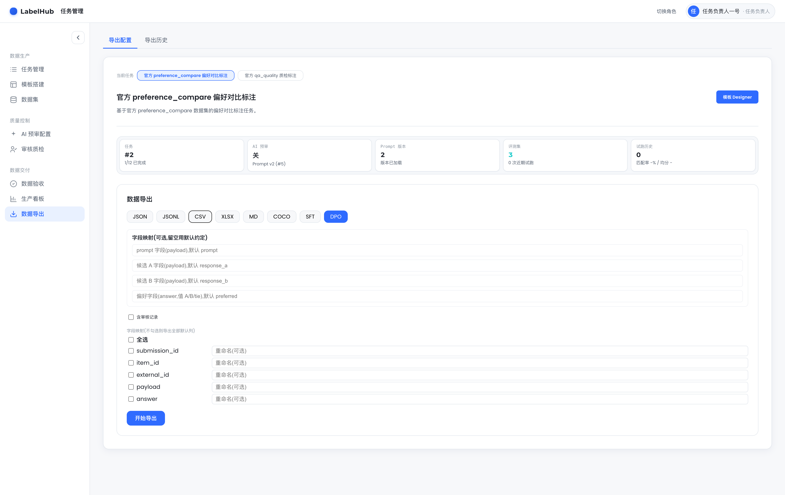
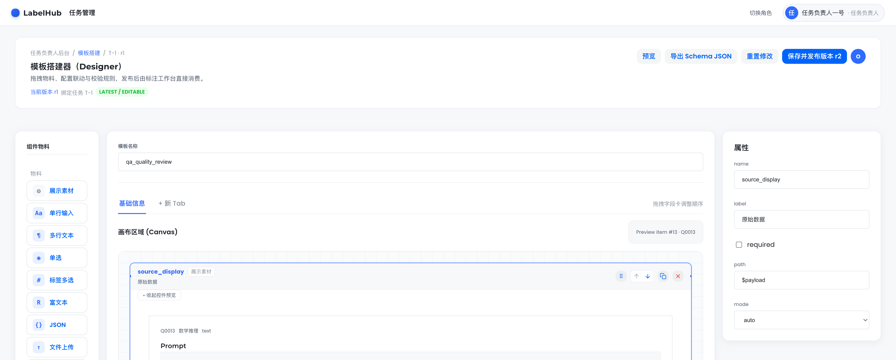
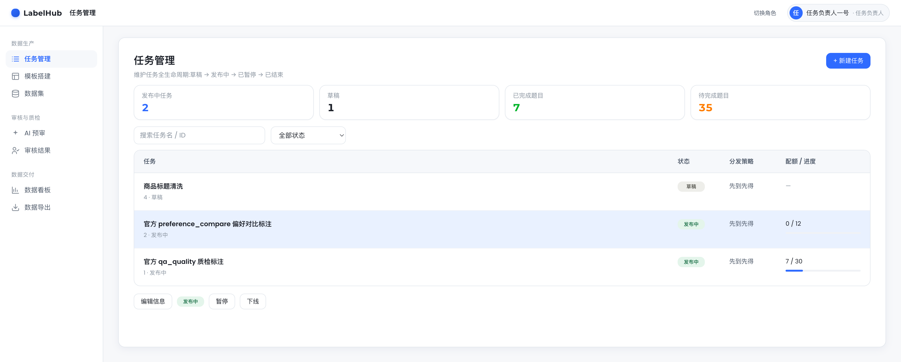
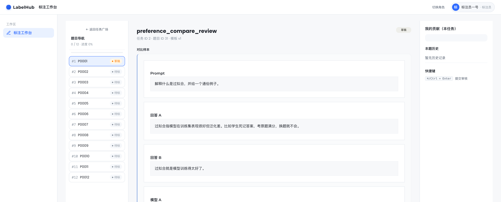
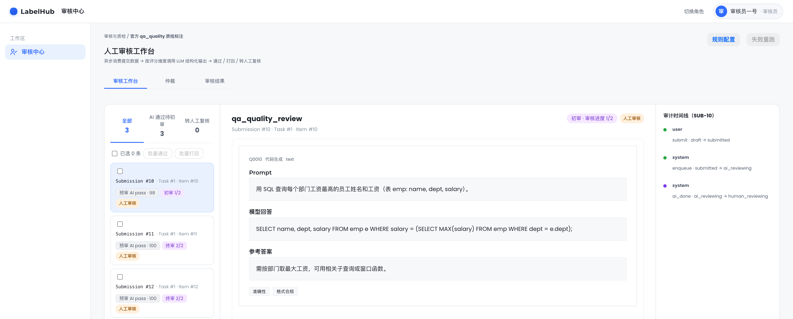

# LabelHub · 数据标注平台

[](https://github.com/URneiU1/LabelHub/actions/workflows/ci.yml)
[](LICENSE)
[](go.work)
[](apps/web/package.json)
[](apps/web/tsconfig.app.json)

> 字节 AI 全栈挑战赛课题 — 覆盖「数据生产 → AI 预审 → 人工审核 → 多格式导出」全生命周期的 Web 数据标注平台。

**评委友好链接**:
- [`submission/`](submission/) — 评委交付包(完整 walkthrough、演示视频脚本、截图)
- [`docs/ARCHITECTURE.md`](docs/ARCHITECTURE.md) — 架构图与决策表
- [`docs/DEPLOY.md`](docs/DEPLOY.md) — 单机部署 SOP
- [`docs/openapi.yaml`](docs/openapi.yaml) · [`docs/LabelHub.postman_collection.json`](docs/LabelHub.postman_collection.json) — API 契约与请求集
- [`submission/CODE-REVIEW-FINAL.md`](submission/CODE-REVIEW-FINAL.md) — 交付前 4 路并行 code review 汇总

## 在线体验(在线 demo)

已部署在线 demo,**无需本地搭建,打开即用**:

> **http://43.155.210.70** — 用下方[演示账号](#演示账号)登录(如 `owner1` / `123456`)

想本地完整跑(改代码、看 AI worker、换真实豆包 key)见下方「快速启动」。

## 界面预览(1920×1080)

**多格式导出 — 8 格式(含 SFT / DPO 训练格式,直达模型微调)+ DPO 偏好对字段映射**



| **可视化模板 Designer**<br>拖拽物料 / 字段联动 / 多 Tab 嵌套<br> | **Owner 任务管理**<br>全生命周期 + 统计卡 + 状态筛选<br> |
|---|---|
| **Labeler 作答工作台**<br>多物料 + Tabs + 草稿自动保存<br> | **Reviewer + AI 预审结论**<br>verdict / 维度评分 / 审计时间线<br> |

> 截图为 1920×1080;1280×800 版本见 [`submission/assets/screenshots/`](submission/assets/screenshots/)。

## 快速启动(本地搭建)

```bash
# 前置: Docker Desktop / Colima、Go 1.22+、Node 24+、pnpm 10+

# 0. 复制环境文件(默认 LLM_PROVIDER=mock,无需真实豆包 key)
cp .env.example .env

# 1. 一键起基础设施 + 装依赖 + seed
make dev

# 2. 三个终端分别跑长进程
make api       # 终端 A — http://localhost:8080/health
make worker    # 终端 B — AI 预审 worker
make web       # 终端 C — http://localhost:5173
```

若本机 `:8080` 被占用:`API_PORT=18080 make api` 起 API,再 `VITE_API_PROXY_TARGET=http://localhost:18080 make web` 起前端。

### 演示账号

`make seed` 会创建以下账号(密码均为 `123456`):

| 用户名 | 角色 | 用途 |
|---|---|---|
| `owner1` | Owner | 任务/模板/AI Prompt/Golden Sample 配置 |
| `labeler1` | Labeler | 任务广场领题、作答、提交 |
| `reviewer1` · `reviewer2` | Reviewer | 审核队列、AI verdict、两级独立复核(初审 + 终审需不同审核员) |
| `system_ai` | System | AI 预审 Agent(后台,不需登录) |

### 5 分钟评委路径

1. 浏览器打开 demo(在线 **http://43.155.210.70** 或本地 http://localhost:5173)→ 登 `owner1/123456`
2. 进 **Owner Dashboard** → 选官方 `qa_quality` 任务 → 看模板/AI Prompt/Golden Sample/Stats Board(官方任务 seed 后已启用 AI review)
3. 退出登 `labeler1/123456` → **任务广场** → 领取一题 → 作答并提交,触发 AI 预审
4. 退出登 `reviewer1/123456` → **审核队列** → 看 AI verdict + 维度评分 → 初审通过;再登 `reviewer2` 做终审(两级独立,需不同审核员)→ 定稿
5. 回 `owner1` → **导出**(JSON/JSONL/CSV/XLSX/Markdown/COCO/SFT/DPO 任选,SFT/DPO 直达模型微调)→ 下载

完整 walkthrough 见 [`submission/`](submission/) 交付包。

## 架构

```
apps/web        React 18 + TypeScript(strict)+ Semi Design(单一 SPA,角色路由)
apps/api        Go + Gin + GORM REST API(:8080)
apps/ai-worker  Go + Asynq AI 预审 Worker(豆包 Function Calling)
pkg/exporter    共享多格式导出器(JSON / JSONL / CSV / XLSX / Markdown / COCO / SFT / DPO)
pkg/llmreview   共享 LLM provider(mock / OpenAI-compatible / 豆包)
```

| 基础设施 | 端口 |
|---|---|
| MySQL 8 | localhost:13306(user=labelhub, pass=labelhub_dev) |
| Redis 7 | localhost:6379 |
| Adminer(DB GUI) | http://localhost:18080 |
| Asynqmon(queue 监控,ops profile) | http://localhost:18081 |

完整架构图与设计决策见 [`docs/ARCHITECTURE.md`](docs/ARCHITECTURE.md)。

## 关键技术亮点

- **状态机驱动** — 任务 4 态 + 提交 7 态,所有跃迁走 `internal/statemachine.Transitions()`,100% 单测覆盖,违法事件直接 reject
- **Outbox 一致性** — 业务事务同写 `outbox_events`,后台 publisher 用 `FOR UPDATE SKIP LOCKED` + deterministic Asynq TaskID 防双投
- **AI 预审幂等** — Worker `complete()/failover()` 双锁 + `RowsAffected != 1` 守每个状态跃迁,保证 5xx 重试不破坏状态
- **熔断 + 限流** — Provider 5xx 连续 20 次/5 分钟自动熔断,dry-run 走 task-scoped quota,登录走 IP token bucket
- **导出直达训练管线** — 除 JSON/JSONL/CSV/XLSX/Markdown/COCO 外,新增 **SFT**(OpenAI Chat 微调 `messages`)与 **DPO**(偏好对 `prompt/chosen/rejected`,自 `preference_compare` 任务推导)导出,内联质量溯源 metadata(AI 分数 / 人工结论),标注产物可直接喂模型微调
- **AI prompt 快照 + 配置漂移** — 每条预审落库「AI 实际看到的 prompt 全文」`prompt_snapshot` + sha256 指纹(与发送给 LLM 的 `buildMessages` 同源,保证快照即真相);审核台展示渲染后快照,并在该预审所用 prompt 配置已非任务当前生效版本时标「配置漂移」,审核员可判断结论是否基于旧配置
- **Schema 破坏性变更检测** — `internal/schemadiff` 递归比对模板版本间字段变更(穿透 Group/Tabs 嵌套),分级 safe / warning / breaking(删字段、改控件、加必填、删选项…);Owner 保存新版本前「兼容性检查」预知改动是否让历史标注失效
- **类型契约** — `docs/openapi.yaml` 是真相源,`pnpm -F web gen:api` 生成 `schema.d.ts`,前端 TypeScript strict mode + 0 个 `any`
- **测试纪律** — testcontainers 真 MySQL+Redis 集成测试覆盖主链路(submit→outbox→Redis→AI→review→export);CI 跑 Go workspace + web test+lint+build + 独立 `-tags=integration` job
- **首屏性能** — VChart 通过 `React.lazy` + Vite vendor split,首屏 eager vendor 从 2.2MB(gzip 616KB)降到 412KB(gzip 125KB)
- **大数据量压测 + 虚拟滚动(线上实测)** — 单任务导入 5000 题:`import-file` 5.4s、`publish` 0.24s、`GET labeler/items`(全量 5000 行 ≈468KB)0.7s、领题/打开题目 0.2–0.4s,API 侧均无瓶颈。压测发现题目导航原为**全量渲染**(5000 题 → DOM ~20K 节点、4× 节流首屏 Layout 220ms + Style 重算 237ms,有可感卡顿),已落地**定高虚拟滚动**(`ItemNav` 仅渲染视口内行 + overscan):渲染行数由视口决定、与题目总数解耦(实测视口 120px 仅渲染 11 行,5000 题同视口约 18 行),切题自动滚入视口;核心区间逻辑 `visibleRange` 纯函数单测覆盖(`ItemNav.test.tsx`)
- **编辑级 UI 系统** — 自建 Editorial design tokens(serif headings + 7 态 status + skeleton/top-progress),非套模板默认
- **A11y** — Tabs 完整 ARIA `tablist/tab/tabpanel` + auto-jump first error tab,全局 `:focus-visible` ring,Labeler `Ctrl/Cmd+Enter` 提交快捷键

## 命令速查

```bash
make dev          # 一键起基础设施 + 装依赖 + seed
make up / down    # 起/停基础设施
make install      # 装 pnpm + Go 依赖
make seed         # 初始化两个官方任务(qa_quality 30 条 + preference_compare 12 条)
make api          # 跑 API
make worker       # 跑 AI worker
make web          # 跑前端

# 测试
go test ./apps/api/... ./apps/ai-worker/... ./pkg/...
pnpm -F web test                    # vitest
pnpm -F web lint                    # eslint
pnpm -F web build                   # 类型检查 + 打包

# 集成测试(需 Docker)
go test -tags=integration ./apps/api/internal/integration -count=1

# 生产部署
docker compose -f deploy/docker-compose.prod.yml --env-file deploy/.env.example up -d
```

## 目录结构

```
.
├── apps/
│   ├── web/              React 前端(单一 SPA,角色路由)
│   ├── api/              Gin REST API(handler / service / model)
│   └── ai-worker/        Asynq AI 预审 worker
├── pkg/
│   ├── exporter/         JSON / JSONL / CSV / XLSX / MD / COCO / SFT / DPO 导出器
│   └── llmreview/        LLM provider(mock + OpenAI-compatible)
├── tools/seed/           官方数据集(qa_quality + preference_compare)+ 模板
├── deploy/               生产 docker-compose + Caddyfile + Dockerfile
├── docs/                 架构 / 部署 / API / Code Review / CHANGELOG
├── submission/           评委交付包
└── .github/workflows/    CI(单测 + 集成测试)
```

## License

[MIT](LICENSE)
