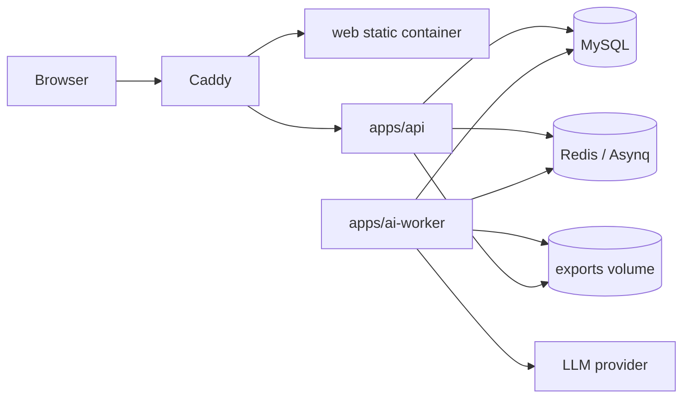
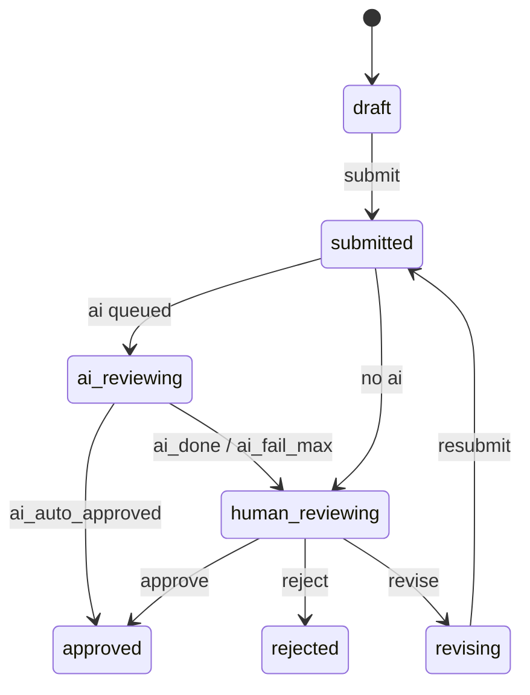
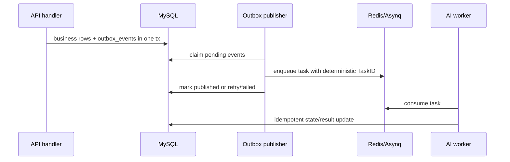

# LabelHub Architecture

LabelHub is a monorepo data labeling platform. The current production path is:

- `apps/web`: React 18 + TypeScript SPA, Semi UI, Vite.
- `apps/api`: Go + Gin REST API, MySQL persistence, migrations on startup.
- `apps/ai-worker`: Go Asynq worker for AI review, dry-runs, and async exports.
- `pkg/exporter`: shared JSON/JSONL/CSV/XLSX export engine.
- `pkg/llmreview`: shared mock/OpenAI-compatible AI review evaluator.

## Runtime Topology



The API and worker both mount the same absolute `EXPORT_DIR`. Worker writes export files, while API verifies signed download tokens and streams the file. Relative export paths are rejected at process start.

## Main Labeling Flow



The state machine is centralized under `apps/api/internal/statemachine`. Review and submission services lock rows in transactions and reject invalid transitions instead of letting handlers mutate states ad hoc.

## Outbox And Queueing



This keeps API writes durable even if Redis is briefly unavailable. Deterministic Asynq `TaskID` values make duplicate enqueue attempts safe.

## API Contract

HTTP responses use one envelope:

- Success: `{ "data": ..., "request_id": "..." }`
- Error: `{ "error": { "code": "...", "message": "..." }, "request_id": "..." }`

Common error codes are `VALIDATION_ERROR`, `UNAUTHORIZED`, `FORBIDDEN`, `NOT_FOUND`, `CONFLICT`, `GONE`, `LLM_PROVIDER_ERROR`, and `INTERNAL_ERROR`.

`docs/openapi.yaml` is the source for the documented main-flow API surface in S5. The generated frontend type artifact is `apps/web/src/shared/api/schema.d.ts`, produced by:

```bash
pnpm -F web gen:api
```

## Key Decisions

| Area | Decision | Reason |
|---|---|---|
| Monorepo | Separate Go modules plus `go.work`, one pnpm workspace for web | Keeps deploy units independent while sharing exporter/LLM packages |
| Schema runtime | Existing renderer/designer stack | Avoids migration churn during contest delivery |
| AI review | Durable outbox + Asynq worker | Provider latency/failure should not block API transactions |
| Exports | Async worker + signed downloads | Large exports can retry, and downloads do not require long-running API work |
| Deployment | Docker Compose + Caddy | Simple single-host production template with automatic HTTPS |
